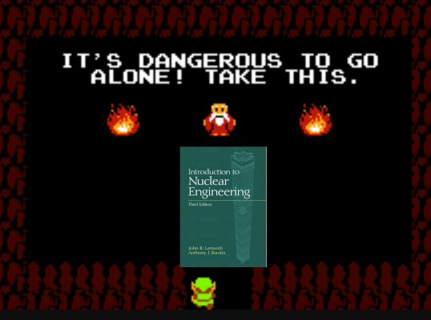

# A miniproj for Oklo 

For question 1, the notebook is both a slideshow and a notebook so it reads a little funny.
I wanted to stretch myself a little to try a new presentation format.
And it also makes maintaining slides a lot easier if the code used to
generate your figures is a part of your presentation.

Typically if I were given a problem like this, I would ask for help. Working in
fleet support for the past year has made me very comfortable with asking for help
from folks that know a lot more about a particular topic, part, or procedure than I do.
However, asking for help seemed to be against the spirit of this mini-project.
I don't have access to pay-walled scientific publications on my home computer, and it felt like
a minor ethics violotion to use my work computer to do research for a job
interview, so...

I've been spoiled by Stackoverflow's massive python and C++ QA library. Turns out it's
a bit more difficult to google topics like, "what is spectral hardening?" without a
subscription to ScienceDirect.

With regards to code comments, my rule of thumb is to write comments according to my audience.
In many cases, my audience is full of engineers, and therefore my comments
are extensive. But comments, like lines of code, increase the inventory
of an application. As your inventory goes up, your operational cost
increases as well.
If the code is obvious or the audience is
savvy, comments oftentimes are not necessary. However, I'll be using
lots of comments in this project assuming my audience is primarily engineers,
plus the fact that computational code is confusing and hard to read.

For python, I do always use docstrings. For everything. Flake8 makes me.
